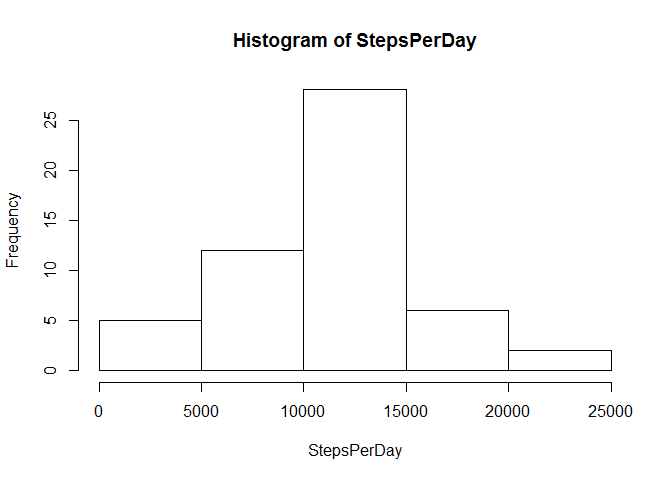
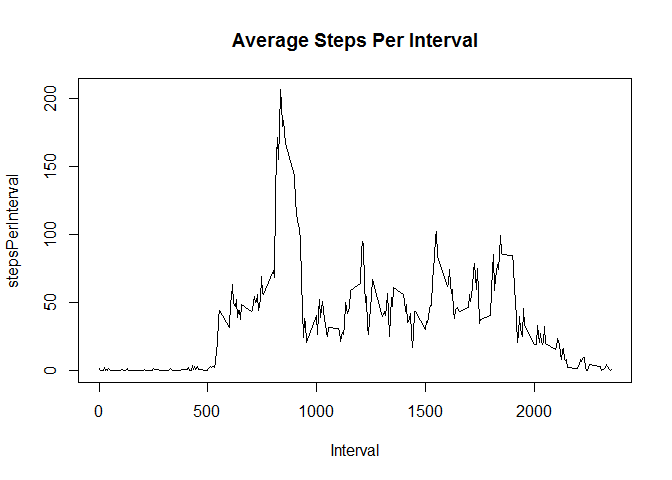
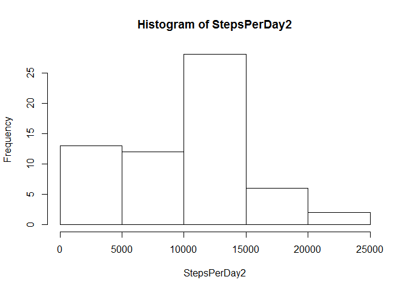
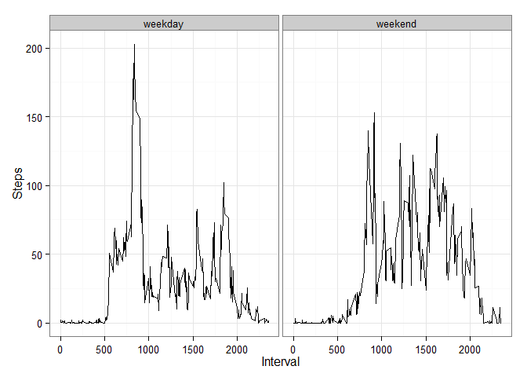

# Reproducible Research: Peer Assessment 1


## Loading and preprocessing the data

```r
data<-read.csv("activity.csv")
library(ggplot2)
```

```
## Warning: package 'ggplot2' was built under R version 3.1.2
```
## What is mean total number of steps taken per day?

```r
Q1<-data[complete.cases(data),]
StepsPerDay<-tapply(Q1$steps,Q1$date,sum)
hist(StepsPerDay)
```

 

```r
##mean steps per day with NAs removed
mean(StepsPerDay,na.rm=TRUE)
```

```
## [1] 10766
```

```r
##median steps per day with NAs removed
median(StepsPerDay,na.rm=TRUE)
```

```
## [1] 10765
```
## What is the average daily activity pattern?

```r
Q2<-data[complete.cases(data),]
StepsPerInterval<-aggregate(Q2$steps,list(Q2$interval),mean)
colnames(StepsPerInterval)<-c("Interval","stepsPerInterval")
plot(StepsPerInterval,type="l")
title("Average Steps Per Interval")
```

 

```r
##Interval contains maximum steps per interval
Index<-which.max(StepsPerInterval[,2])
StepsPerInterval[Index,1]
```

```
## [1] 835
```

## Imputing missing values

```r
##The number of NAs in the matrix
sum(is.na(data))
```

```
## [1] 2304
```

```r
Q3<-data
##Strategy: Replace the NAs with the average steps that day
Replace<-tapply(Q1$steps,Q1$date,mean)
Replace[is.na(Replace)]<-0
Dates<-as.character(data$date)
NAindex<-which(is.na(data))
n<-length(NAindex) 
for(i in 1:n){
  index<-NAindex[i]
  inter<-grep(Dates[index],names(Replace))
  Q3$steps[index]<-Replace[inter]
}
StepsPerDay2<-tapply(Q3$steps,Q3$date,sum)
hist(StepsPerDay2)
```

 

```r
##Mean steps per day after filling the NAs
mean(StepsPerDay2,na.rm=TRUE)
```

```
## [1] 9354
```

```r
##Median steps per day after filling the NAs
median(StepsPerDay2,na.rm=TRUE)
```

```
## [1] 10395
```

## Are there differences in activity patterns between weekdays and weekends?

```r
Sys.setlocale("LC_TIME", "English")
```

```
## [1] "English_United States.1252"
```

```r
##Create a new factor variable with two levels – “weekday” and “weekend” 
Indicator<-(weekdays(as.Date(Q3$date)))
n<-length(Indicator)
weekday<-c("Monday","Tuesday","Wednesday","Thursday","Friday")
for(i in 1:n){
  inter2<-grepl(Indicator[i],weekday)
  if(sum(inter2)==1){Indicator[i]<-"weekday"} 
  if(sum(inter2)==0){Indicator[i]<-"weekend"}
}
Q4<-cbind(Q3,Indicator)
part<-split(Q4,Q4$Indicator)
wkSteps<-part[[1]]
wkeSteps<-part[[2]]
wkAvg<-aggregate(wkSteps$steps,list(wkSteps$interval),mean)
wkeAvg<-aggregate(wkeSteps$steps,list(wkeSteps$interval),mean)
wkAvg<-cbind(wkAvg,rep("weekday",288))
colnames(wkAvg)<-c("Interval","Steps","Indicator")
wkeAvg<-cbind(wkeAvg,rep("weekend",288))
colnames(wkeAvg)<-c("Interval","Steps","Indicator")
Q4<-rbind(wkAvg,wkeAvg)
p<-ggplot(Q4,aes(x=Interval,y=Steps))+theme_bw()
p+geom_line()+facet_grid(. ~ Indicator)
```

 
